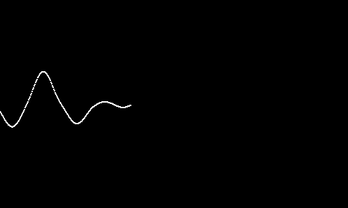
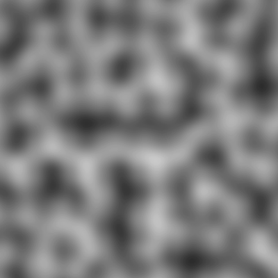
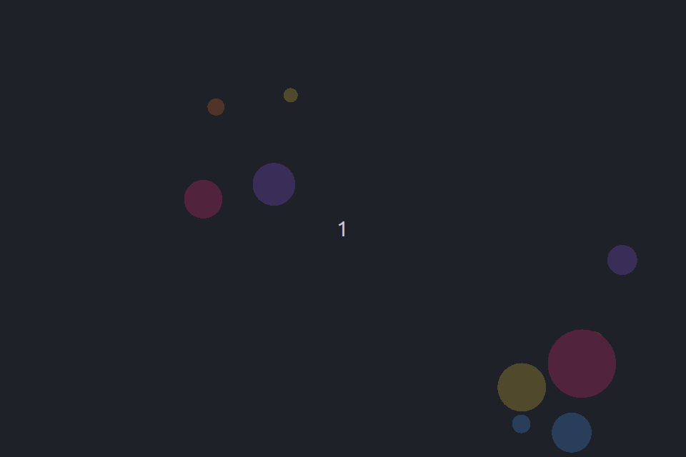
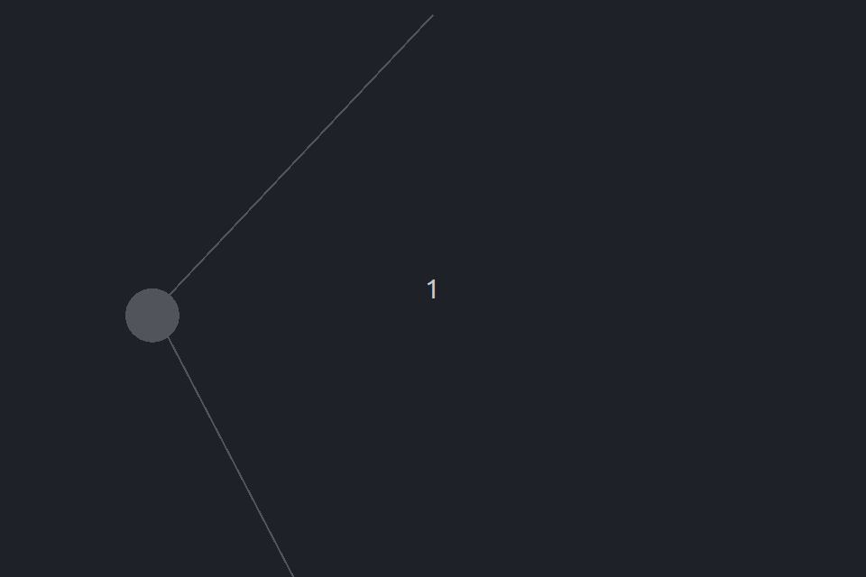
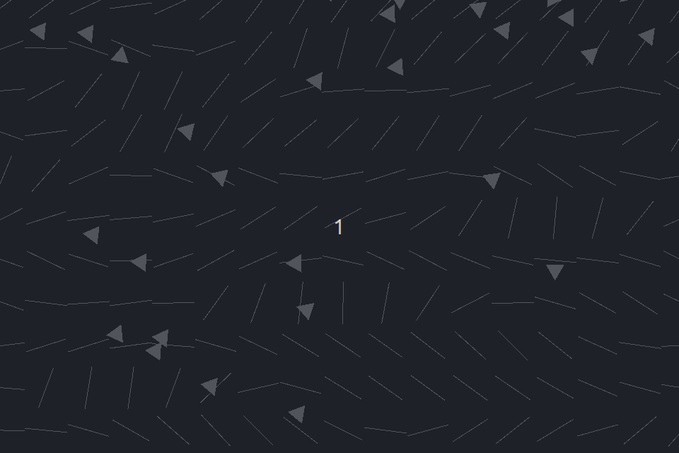

## 自述
这是一个使用 sfml 实现 Daniel Shiffman 的 [Nature of Code](https://natureofcode.com/) 这本书的项目 </br>
使用 CMake 构建，顶层有一个共用 cmake </br>
实现不同章节的 cmake 管理 </br>
每个章节的实现不与书上完全一样，大多以书为启迪，自己实现的

### 概览
#### [随机](0.randomness/README.md)


</br>
</br>

#### [力矢](2.forces/README.md)

</br>
</br>

#### [振荡](3.oscillation/README.md)

</br>
</br>

#### [自主代理](5.autonomous_agents/README.md)


#### [群落](5.boids/README.md)


### TODO
+ [ ] 随机二维柏林噪声，生成流场；更好的话是三维，加上时间维度

### 在 linux 上构建
#### 环境
   ```
   sudo apt update
   sudo apt install \
       libxrandr-dev \
       libxcursor-dev \
       libxi-dev \
       libudev-dev \
       libfreetype-dev \
       libflac-dev \
       libvorbis-dev \
       libgl1-mesa-dev \
       libegl1-mesa-dev \
       libfreetype-dev
   ```
#### 在根目录构建

   ```
   cmake -B build
   cmake --build build
   ```

#### 运行
可执行文件在 build 目录下的 bin 文件夹里

### 在 windows 上构建
#### 环境
上 sfml 官网下载制定版本的 mingw，我使用的 sfml 版本是 3.0.2（这个在 common.cmake 中可见）。
#### 构建
稍微配置一下工具链即可构建

### 关于 CMake

Here are some useful resources if you want to learn more about CMake:

- [Official CMake Tutorial](https://cmake.org/cmake/help/latest/guide/tutorial/)
- [How to Use CMake Without the Agonizing Pain - Part 1](https://alexreinking.com/blog/how-to-use-cmake-without-the-agonizing-pain-part-1.html)
- [How to Use CMake Without the Agonizing Pain - Part 2](https://alexreinking.com/blog/how-to-use-cmake-without-the-agonizing-pain-part-2.html)
- [Better CMake YouTube series by Jefferon Amstutz](https://www.youtube.com/playlist?list=PL8i3OhJb4FNV10aIZ8oF0AA46HgA2ed8g)
